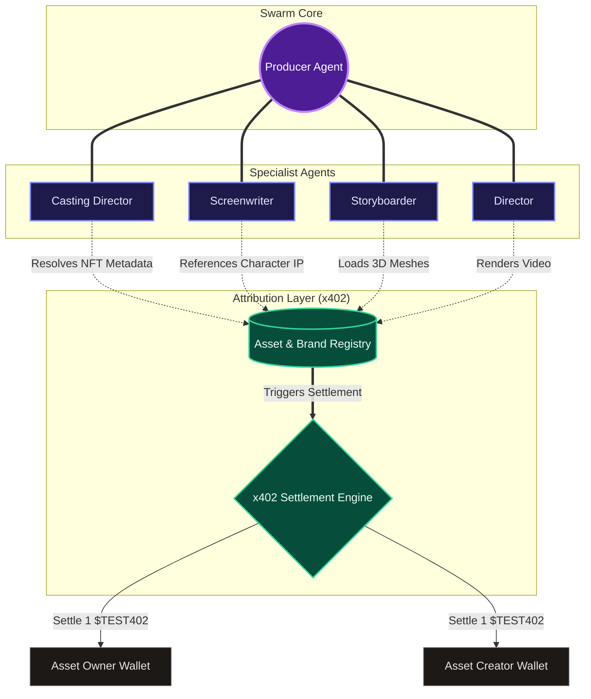

# minds.MONSTER — Make Movies with Your Mind

**minds.MONSTER** is a decentralized cinematic video generation platform designed for creators, brand IP activation, and automated creative pipelines. It allows anyone to turn real-world brand assets (NFT artwork, 3D meshes) into fully-realized cinematic films using an orchestrating swarm of specialized AI agents.

* **Live Site:** [https://minds.monster](https://minds.monster)
* **Status:** Hackathon Submission Completed & Live in Production

---

## 📂 Git Branch Inventory

* **`neural-canvas` (Active / Main Development Branch)**: Contains the entire completed application code—including the React Three Fiber 3D canvas viewports, custom checkout upsell panels, Stripe payment webhook idempotency, Zora explorer support, and the serverless Cloudflare Worker swarm. **This is the branch currently deployed to production.**
* **`feat-x402`**: Implements the NFT payment service integration (x402 protocol) with transaction status UIs, static NFT data support, re-answering capability for screen tests, and script revision handling.
* **`main`**: The base React+Vite boilerplate branch.

---

## 🛠️ Tech Stack & Services

* **Frontend**: React + Vite (Vanilla CSS, Lucide icons, Three.js & React Three Fiber for 3D geometry viewing, Glassmorphism UI).
* **Backend**: Serverless **Cloudflare Workers** running our agent swarm, integrated with **[hellominds.ai](https://hellominds.ai)** APIs and client library to manage persistent mind states, identity connections, and creative briefings.
* **Storage / Database**:
  * **Cloudflare KV**: Dossiers, mind configurations, session signing, and progress logs.
  * **Cloudflare R2**: High-speed binary storage for generated storyboard frames and movie files.
* **External APIs**:
  * **Alchemy SDK**: Powers multi-chain NFT queries (Ethereum, Base, Zora) to fetch metadata.
  * **IPFS (via Pinata)**: Decentralized storage for media content CIDs.
  * **OpenSea API**: Used to query cross-chain registry states to find the asset's active owner.
  * **Stripe API**: Processes top-up budgets (credits) for higher-fidelity video rendering.

---

## 🤖 Swarm Agent Architecture & x402 Protocol

The swarm operates with a central coordinator (the Producer) driving specialized microservice agents. The system is designed to integrate the **x402 Attribution Protocol**, which automatically handles split micro-payments in `$TEST402` tokens when agents invoke registered brand assets.



### Agent Model Reference

1. **Producer (Core)**: 
   * *Model*: `MiniMax-M3` (as served by [hellominds.ai](https://hellominds.ai))
   * *Role*: Manages visitor session state, enforces credit/budget limits, maintains persistence of screenplay drafts and generated assets, and stages tasks into serverless background queues.
2. **Casting Director (Analyst)**:
   * *Model*: `nvidia/nemotron-3-nano-omni-30b-a3b-reasoning` (via NVIDIA NIM)
   * *Role*: Analyzes uploaded visual assets and maps NFT metadata to 3D mesh dossiers.
3. **Screenwriter**:
   * *Model*: `nvidia/nemotron-3-super-120b-a12b` (via NVIDIA NIM)
   * *Role*: Transforms prompts and characters into full screenplay directions and dialogues.
4. **Storyboarder**:
   * *Paid Tier Model*: `gpt-5.6-sol` (via OpenAI API, high reasoning effort)
   * *Free Tier Model*: `nvidia/nemotron-3-ultra-550b-a55b:free` (via OpenRouter)
   * *Role*: Blocks camera positioning and computes visual spatial scene geometry.
5. **Director**:
   * *Video Gen*: `MiniMax-H3` (Hailuo 3.0) & `MiniMax-Hailuo-02` (via MiniMax API)
   * *Audio Gen*: `music-3.0` (Music Engine) & `speech-02-hd` (Voice Engine)
   * *Judge Model*: `nvidia/nemotron-3-nano-omni-30b-a3b-reasoning`
   * *Role*: Assembles multi-character video frames, synthesizes scores, and judges rendering quality.

---

## 🚀 Local Development Setup

To run the client and local mock worker environments:

1. **Install Dependencies**:
   ```bash
   npm install
   ```

2. **Configure Environment Variables**:
   * Pull the shared environment variables securely using:
     ```bash
     npx share-env pull <share-code>
     ```
   * Move the `# Worker Secrets` variables from the bottom of `.env` into a new local `.dev.vars` file in the project root.

3. **Start Vite Client** (port `5173`):
   ```bash
   npm run dev
   ```

4. **Start Wrangler Dev Worker** (port `8789`):
   ```bash
   npm run dev:worker
   ```

5. **Deploy to Cloudflare Production**:
   ```bash
   npm run deploy
   ```
